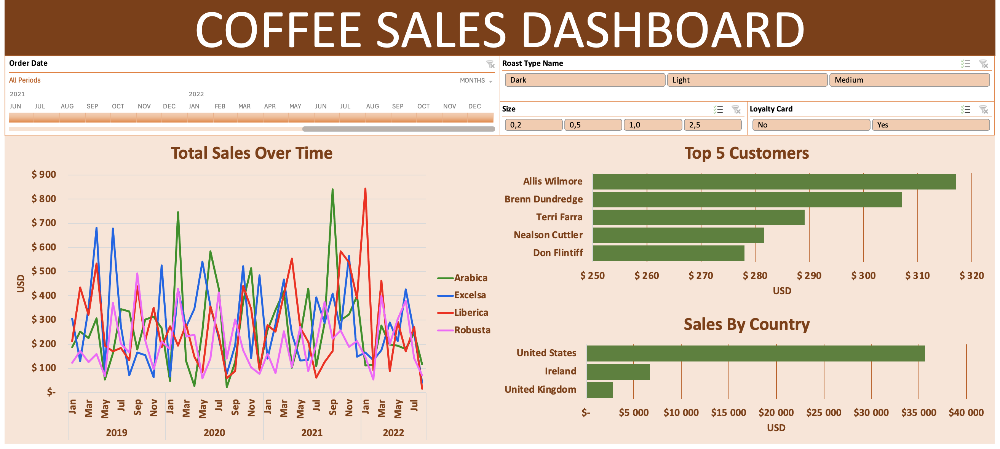
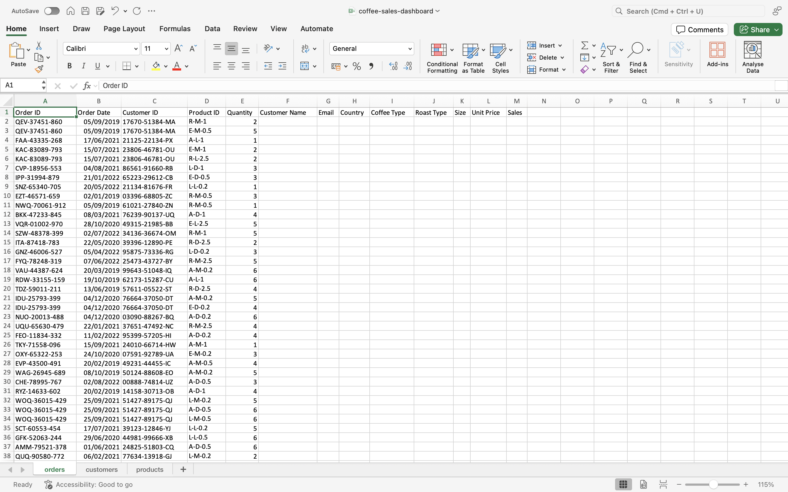
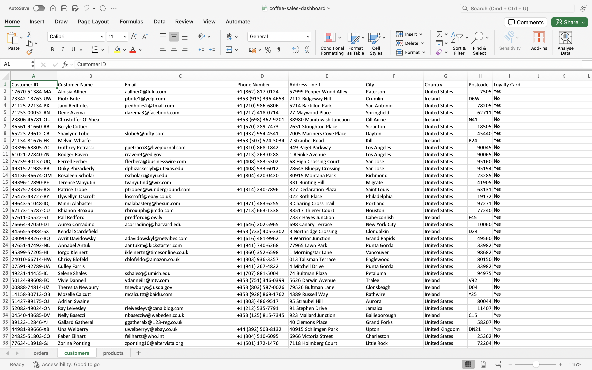
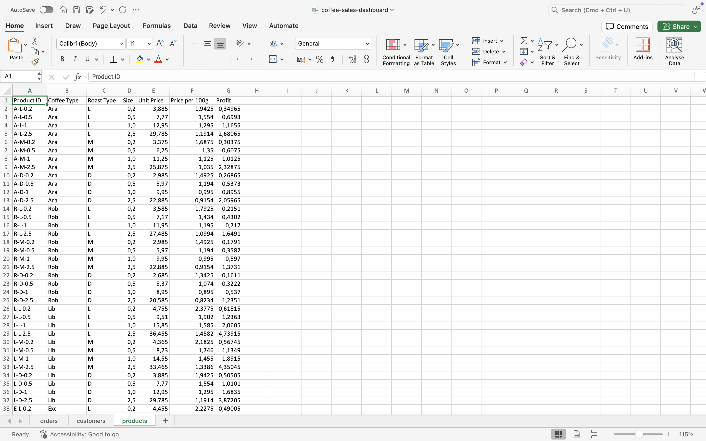
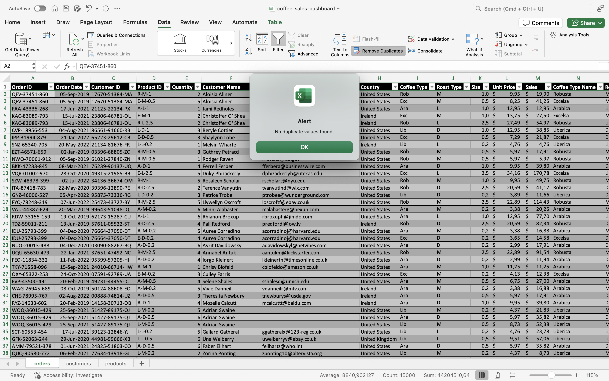
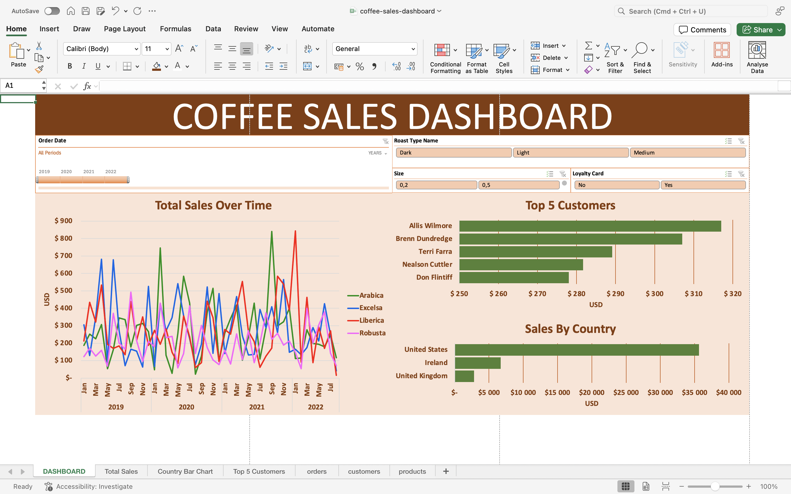

# ☕ Coffee Sales Dashboard

### 🎯 Project Goal  

The dataset provided contains information on coffee sales, including product, customer, and order data. The objective of the project was to create an interactive dashboard in **Microsoft Excel**, enabling users to intuitively explore sales data using available filters and visualization tools.  

  

# 📒 Project Development Report  

### Data Sources  

The dataset was obtained from the GitHub repository of [mochen862](https://github.com/mochen862/excel-project-coffee-sales). It consists of three main tables:  

- **Customers** – contains customer information such as full name, phone number, address, and loyalty card status.  
- **Products** – provides details about the offered products (coffee type, description, price).  
- **Orders** – includes detailed order information such as customer ID, product ID, date, and order quantity.  

  
*`Orders` table – an overview of all orders with linked customers and products.*  

  
*`Customers` table – customer data with loyalty card information.*  

  
*`Products` table – detailed information on the coffee products offered.*  

---

### Data Cleaning  

The first step in preparing the dataset was checking and removing duplicates. No duplicated records were found, which allowed moving directly to the next stage of data processing.  

  
*Duplicate analysis result – no duplicated records detected.*  

---

### Data Processing  

The next step involved filling in missing values in the **Orders** table. To achieve this, the `XLOOKUP()` formula was applied, allowing for dynamic retrieval of missing details from the **Products** table.  

As a result, the report included complete product names – for example, instead of the shortened name `Ara`, the full name `Arabica` was added. Similar adjustments were made for other coffee types to improve readability and consistency.  

---

### Dashboard  

The prepared **sales dashboard** in Excel allows for interactive data analysis covering the period from **January 2019 to December 2022**. It was designed to support both an overview of general sales trends and more detailed exploration of data from various perspectives.  

The dashboard includes, among others:  
- **Time analysis** – visualization of sales dynamics by months and years, enabling identification of seasonal peaks in demand.  
- **Top 5 customers** – a ranking of customers with the highest number of orders, making it easier to identify key clients.  
- **Geographic analysis** – visualization of sales by country, helping to highlight the most important markets.  

Additionally, users can benefit from **interactive filters** that allow them to customize the displayed data:  
- **Time period** – selection of the analyzed timeframe,  
- **Coffee bean type** – e.g., Arabica, Robusta, blends,  
- **Package size** – small, medium, and large formats,  
- **Loyalty card status** – comparison of purchase behaviors between customers with and without loyalty cards.  

  
*Final dashboard view – interactive coffee sales analysis with multiple filtering options.*  
